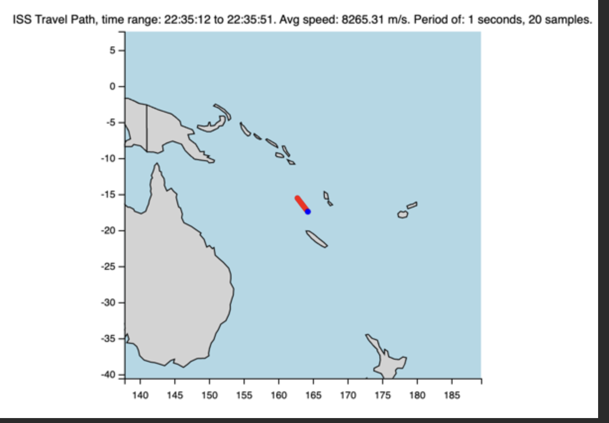

Questions[]: # Path: README.md

Suppose you have a program that does the following:

- Using a public API, it regularly gets the current position of the international space station (ISS).
- It draws a series of points (ISS coordinates) on a map and calculates the average speed.

1) How would you test such an application?

- what are some of the testcase you can think of to test the application?

2) Can you write an implementation (any language or pseudocode) of a simpler version of the program that only polls the
   APIs repeatedly to calculate the current speed of the international space station and prints it to standard output?

For convenience there is an open service to get the real-time ISS position: http://api.open-notify.org/iss-now.json

You can try it in your browser to see the resulting json that looks like:

{
timestamp: 1547626790,
message: "success",
iss_position: {
latitude: "48.4406",
longitude: "-87.2757"
}
}

Please feel free to use any library to support your implementation and make sure to write down any assumption you make.

Answers[]: # Path: README.md

1) For the answer to question 1 I did a series of tests in the "test_iss_manager" file. these are all integration 
tests as they interact with external resources. To do a complete job, unit tests with magic mocks would have to be 
added as well. The tests I came up with, apart from the trivial ones of checking the OpenApi response. 
Are those of checking against sample length, correctness of average velocity calculation as well 
as tests related to ranges in lat and lon and ISS station velocity "documentation comment in the method 
for more details". Please take a look at file "test_iss_manager.py"

2) For response 2 run the "iss_manager" file, in fact,
Two public methods can be found in the "ISSManager" class: "sample_position", which prints positions and velocity 
and "plot_samples_on_globe", which plots with matplotlib as was assumed in the assignment description.

You can find definitions and specifications inside the "iss_manager" class and the "test_iss_manager" file.

screen shot of the plot:

